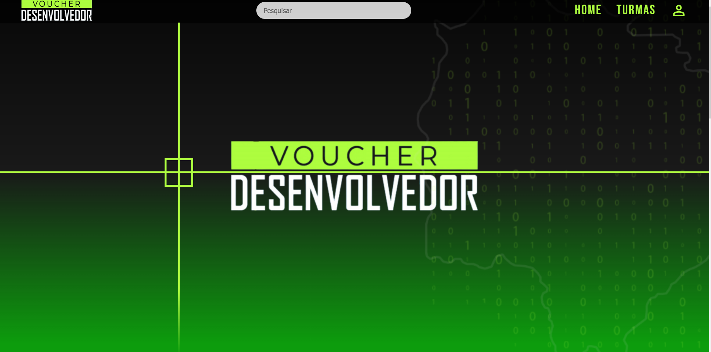
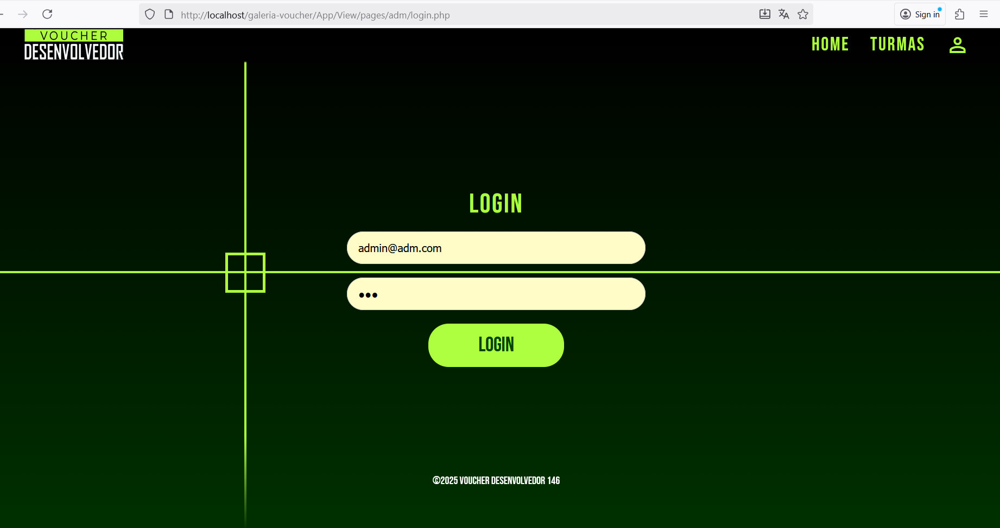
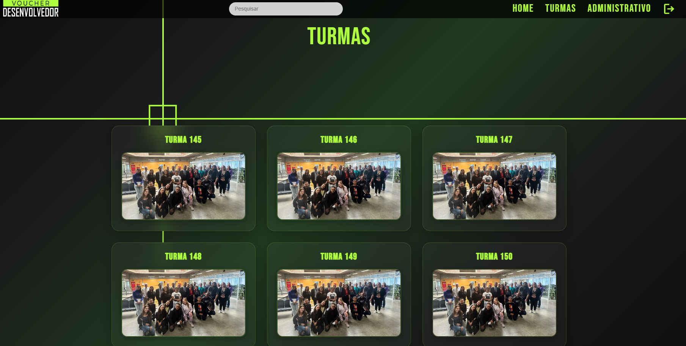
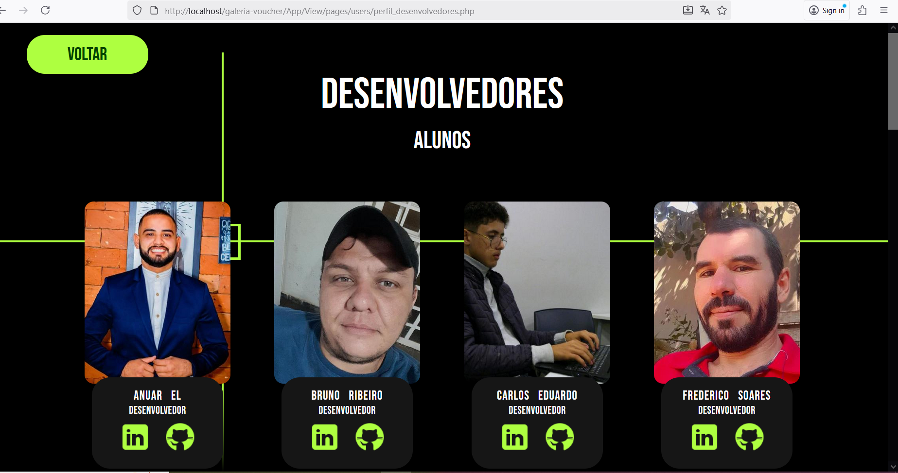
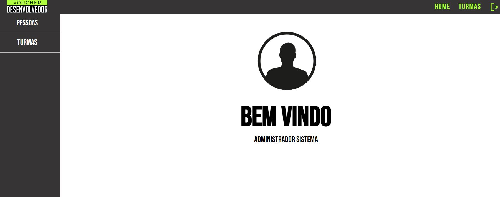

<div align="center">

# 🎓 GALERIA VOUCHER
</div>

<div align="center">
  <picture>
    <source media="(prefers-color-scheme: dark)" srcset="App/View/assets/img/utilitarios/voucher-logo-green.jpg">
    <source media="(prefers-color-scheme: light)" srcset="App/View/assets/img/utilitarios/voucher-logo-green.jpg">
    
  </picture>
</div>

A **Galeria Voucher** é um projeto desenvolvido para exibir as turmas participantes do programa governamental de formação técnica em **Desenvolvimento de Sistemas**, com destaque para os **Projetos Integradores (PI)** criados durante o curso.

## 🖼️ Visão Geral do Sistema

| Tela | Miniatura | Descrição |
|------|------------|-----------|
| 🏠 **Home** |  | Página inicial da Galeria, com destaque para turmas e projetos. |
| 🔐 **Login** |  | Acesso administrativo para manutenção de dados e cadastro de novas turmas. |
| 👩‍🏫 **Turmas** |  | Listagem e detalhes das turmas participantes do programa. |
| 👨‍💻 **Desenvolvedores** |  | Página que apresenta os criadores e mantenedores do projeto. |
| 🛠️ **Administrador** |  | Painel de gerenciamento utilizado manter os dados atualizados. |

## 📌 Objetivo

O objetivo da **Galeria Voucher** é **centralizar e divulgar** os trabalhos desenvolvidos pelas turmas, promovendo visibilidade às soluções criativas e técnicas que os alunos criaram ao longo do curso.

📄 **Para informações técnicas e orientações para desenvolvedores**, acesse o documento de apoio:  
🔗 [Orientações para Devs](./Docs/orientacoes-dev.md)


## 🧩 Funcionalidades

- 📚 Exibição das turmas participantes  
- 🧑‍💻 Listagem dos **Projetos Integradores** de cada turma  
- 🔍 Visualização detalhada de cada projeto (descrição, tecnologias usadas, equipe, etc.)  
- 🌐 Interface **amigável e responsiva** para o público  
- ⚙️ Painel administrativo para controle interno (em desenvolvimento)

## 🏛️ Sobre o Programa

O projeto está inserido no **programa governamental de capacitação técnica** que visa preparar estudantes para o mercado de trabalho na área de **Desenvolvimento de Sistemas**.  

Cada turma participante desenvolve, ao longo do curso, um **Projeto Integrador (PI)**, aplicando de forma prática os conhecimentos adquiridos.

<div align="center">

## 🛠️ Tecnologias Utilizadas

| Camada | Tecnologias |
|--------|--------------|
| 🎨 **Frontend** | HTML, CSS, JavaScript |
| ⚙️ **Backend** | PHP |
| 🗄️ **Banco de Dados** | MySQL |

</div>

## 🚀 Como executar o projeto
```bash
# Clone o repositório
git clone https://github.com/VoucherDesenvSenacHub/galeria-voucher.git

# Acesse o diretório do projeto
cd galeria-voucher

# Inicie seu servidor local
# e acesse no navegador:
http://localhost/galeria-voucher
```
## 👥 Colaboradores
[](https://github.com/AnuarRezz)
[](https://github.com/brunoDevfull)
[](https://github.com/yonnnxr)
[](https://github.com/Fred-Curso-Do-Senac-2024-Tc-ADS)
[](https://github.com/henriguisatec)
[](https://github.com/sntosz)
[](https://github.com/joaoheitoror)
[](https://github.com/jeipe)
[](https://github.com/samuelserri)
[](https://github.com/OtavioDayrots)
[](https://github.com/ribinha-code)
[](https://github.com/LucasAjpert)
[](https://github.com/LuisCunha05)
[](https://github.com/LuizzOliveira)
[](https://github.com/Tewdric)
[](https://github.com/matheuscorsine)
[](https://github.com/RiquelmeG22)
[](https://github.com/rodrigo570282)
[](https://github.com/Saambrc)
[](https://github.com/Xavier-sa)
[](https://github.com/WendrilSFS)
[](https://github.com/S4GAZI)
[](https://github.com/Andromeda067)
[](https://github.com/Erikasantos31)
[](https://github.com/Celestiinoo)

<!-- atencao confirma quem deve permanecer no documento e no github com os professores obs os tres abaixo a foto padrao do github quebra la no readem atualizar para images -->
<!-- [](https://github.com/Devs146) -->
<!-- [](https://github.com/jessica249) -->
### Orientadores (Professores)
[](https://github.com/Mauriiicio)
[](https://github.com/thszk)